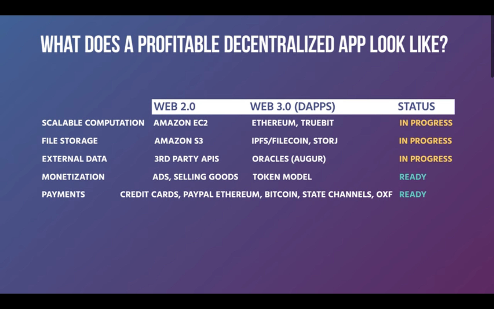
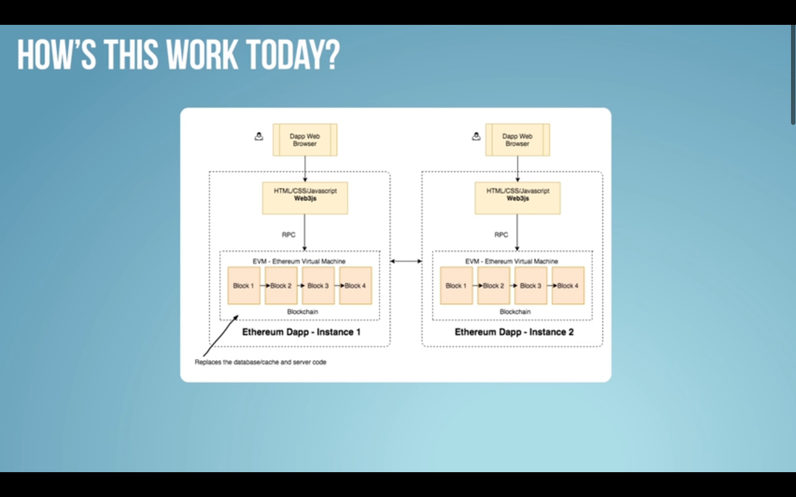
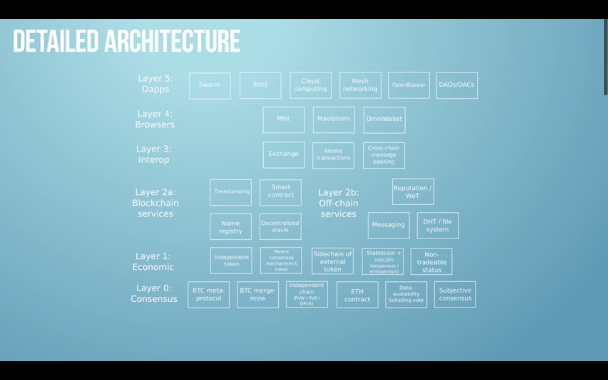

---
params:
  title: "Web 3.0"                
  subtitle: ""
  date: !r Sys.Date()
  email: matthew.malishev[at]gmail.com
  url: "https://www.youtube.com/watch?v=hk8ZDqRpURA"  
  primary: "#518063"  
  # end inputs ---------------------------------------------------------------
header-includes: \usepackage{float}
always_allow_html: yes
output: html_document

---

```{r, setup, echo = FALSE, cache = FALSE, include = FALSE}
options(width=100)
knitr::opts_chunk$set(
  eval = F, # run all code
  echo = T, # show code chunks in output 
  tidy = T, # make output as tidy
  message = F,  # mask all messages
  warning = F, # mask all warnings 
  comment = "",
  tidy.opts=list(width.cutoff=100), # set width of code chunks in output
  size="small" # set code chunk size
)
```

<!-- end yaml  -------------------------------------------------- -->

\  

\  

\  

\  


# `r paste0(params$id,". ", params$title)`      
Reference: [](`r params$url`)      
\  

<!-- ____________________________________________________________________________ -->
<!-- start body -->  

## Intro  
* Web 1.0 = linking things throughout internet  
* Web 2.0 = linking things with apps 
* Web 3.0 = turning centralised apps into decentralised protocols   


Decentralized web != blockchains  
Blockchains  
* Systematize economics and law     
* A protocol, not web-based  

## Web 3.0   
* Inclusive set of protocols to provide building blocks for application makers      
* Movement of associated tech and people making the web decentralised, verifiable, and secure      
* Bridge blockchain network/protocol and decentralized web using web browser services to give users access to blockchain via apps/software       
* Make everything verifiable e.g. smart contracts between product and user that are safer, more resilient, and ethical          

Components    
* Trustless infrastructure and interoperability      
* Remove intermediaries  
* Provide users with power and ownership over their data identity, security, and transactions  
* Authentiate links between data and programs    
* Add verifiability  
* Facilitate autonomous transaction processing   
* Integrate strong economic incentives to allow systems to run autonomously into the future     

## Open services    
E.g. ETH/Bitcoin blockchains  
* Open source    
* Forkability  
* Permissionless entry  
* Offer service over time   
* Optimise value   
* Can maintain and scale infrastructure autonomously  
* Bitcoin built on Turing Incomplete language (restricted to bitcoin network)    
* Ethereum built on Solidity  
  
## Ethereum blockchain  
* Ethereum is built on incentivising ever layer of centralised network, from security to economics to applications    
* Ethereum = cryptography security x mathematical proof of blockchain layers x economic game theory of transactions        

### ETH virtual machine    
* SWARM - file/data storage   
* Whisper - secure messaging   

### Smart contract programming languages  
* Solidity, Serpent, LLL    
* Foundation for jurisdiction i.e. proto-jurisdiction      
* Computable law that is native to the web    
* Decentralised web = encoding jurisdiction into web using blockchain systems    

### Running ETH nodes/blocks (ETH clients)     
* Geth   
* ETH    
* Pyethapp    

### Software releases    
* Frontier    
* Homestead    
* Metropolis    
* Serenity      

### dApps      

     
\  

     
\  

### ETH blockchain architecture    

       
\  

#### dApp -> Decentralised economy (social layer) -> Smart contracts -> Storage and content delivery -> Blockchain      

### DAO    
* Decentralised Autonomous Organisation  
* Invest money and make returns based on crowd-sourced and decentralised decisions from DAO      


## Future avenues  
* What will the web 3.0 browser look like? Single page, wallet, browser extension?  


